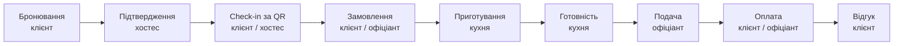

# 1. Аналіз предметної області

## 1.1 Проблема

Типовий візит до ресторану складається з кількох «вузьких місць», які забирають час і гостя, і персоналу:

| Етап | Що відбувається сьогодні | Наслідок |
|---|---|---|
| Бронювання | дзвінок у ресторан, запис у зошит / Excel | помилки, «подвійні» бронювання, неефективне використання столів |
| Прихід гостя | хостес шукає бронювання вручну | черга на вході, гість не знає свого столика |
| Замовлення | очікування офіціанта, усне замовлення | помилки, затримки в години пік |
| Кухня | паперові чеки, крик «на роздачу» | загублені позиції, немає контролю часу приготування |
| Статус | гість не знає, коли буде страва | нервування, повторні питання офіціанту |
| Оплата | очікування рахунку й термінала 10–15 хв | найгірший момент вечора, втрата оборотності столів |

**Smart Restaurant** автоматизує повний бізнес-процес ресторану — від бронювання до оплати — і обʼєднує гостя, зал і кухню в одну систему реального часу.

## 1.2 Користувачі та їх потреби

| Роль | Хто це | Потреби |
|---|---|---|
| **Клієнт** (гість) | відвідувач ресторану | швидко забронювати столик, бачити статус, замовити без очікування, знати коли готова страва, оплатити без рахунку |
| **Працівник залу** (хостес / офіціант) | персонал залу | бачити зал і бронювання в реальному часі, підтверджувати заявки, реєструвати гостей (check-in), приймати та подавати замовлення, фіксувати оплату |
| **Кухня** (кухар) | персонал кухні | чітка черга замовлень, таймери, відмітка готовності, стоп-лист |
| **Адміністратор** (технічна роль) | власник / керівник | керування меню, столами, QR-кодами, користувачами й ролями, аналітика |

## 1.3 Бізнес-процес, що автоматизується

## 1.4 Аналоги

| Функція | **OpenTable** | **Choice QR** (UA) | **Poster POS** (UA) | **Smart Restaurant** |
|---|:---:|:---:|:---:|:---:|
| Онлайн-бронювання столиків | ✅ | ❌ | ⚠️ (модуль) | ✅ |
| Автоматичний підбір столика (алгоритм) | ⚠️ закритий | ❌ | ❌ | ✅ best-fit + фрагментація |
| План залу з вибором столика гостем | ❌ | ❌ | ✅ (для персоналу) | ✅ (гість і персонал) |
| QR-меню за столиком | ❌ | ✅ | ⚠️ | ✅ |
| QR check-in за бронюванням | ❌ | ❌ | ❌ | ✅ |
| Замовлення гостем зі смартфона | ❌ | ✅ | ⚠️ | ✅ (лише після check-in) |
| Статус приготування в реальному часі | ❌ | ⚠️ | ❌ | ✅ WebSocket + ETA |
| Kitchen display system | ❌ | ❌ | ✅ | ✅ |
| Оплата в застосунку | ⚠️ | ✅ | ✅ | ✅ sandbox + 3-D Secure |
| Персональні рекомендації | ⚠️ | ❌ | ❌ | ✅ пояснювані |
| Аналітика | ✅ | ⚠️ | ✅ | ✅ |
| Єдиний Web + Mobile для гостя | ✅ | ⚠️ (лише web) | ❌ | ✅ |

**Висновки.** OpenTable сильний у бронюванні, але не покриває процес у залі; Choice QR — лише електронне меню й замовлення без бронювання та check-in; Poster — POS для персоналу без гостьового застосунку. Жоден аналог не покриває **повний цикл** «бронювання → check-in → замовлення → кухня → оплата» для обох сторін одночасно. Це і є ніша Smart Restaurant.

## 1.5 Чим система відрізняється від CRUD

* **Booking engine** — алгоритм пошуку слотів і вибору оптимального столика з урахуванням буферів між гостями, годин роботи, зони та фрагментації розкладу; гарантія неперетину на рівні БД (EXCLUDE-обмеження PostgreSQL).
* **Скінченні автомати станів** бронювання та замовлення з перевіркою ролі, допустимості переходу й бізнес-умов (дедлайн скасування, вікно check-in, неоплачені замовлення тощо).
* **QR check-in** — підписані QR-коди бронювань і столиків, перевірка «той самий столик», walk-in з автоматичним обмеженням часу візиту.
* **Sandbox-платіжний шлюз** — Luhn, строк дії, 3-D Secure, ідемпотентність, блокування рядка замовлення.
* **Real-time** — усі зміни миттєво потрапляють на Web, Mobile та кухню.
* **Рекомендації та прогноз ETA** — власні алгоритми (асоціативні правила, байєсівський рейтинг, модель черги кухні).
