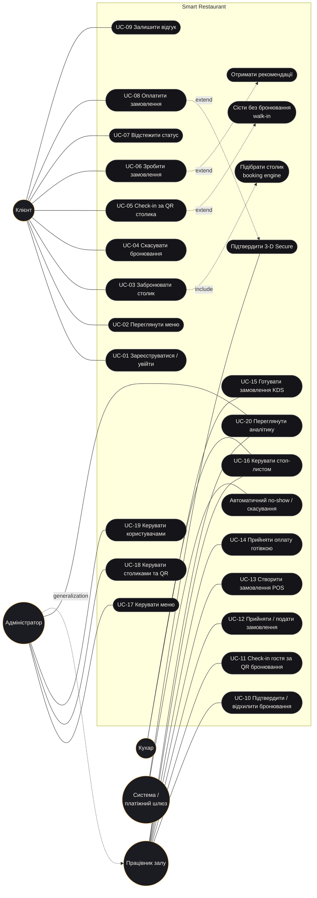

# 3. Use Case Model

## 3.1 Діаграма варіантів використання

## 3.2 Специфікації ключових Use Cases

### UC-03 Забронювати столик
| | |
|---|---|
| **Actor** | Клієнт (Mobile / Web) |
| **Preconditions** | Клієнт автентифікований; активних бронювань < 3 |
| **Trigger** | Клієнт відкриває «Бронювання» |
| **Main Flow** | 1. Клієнт обирає дату, кількість гостей, бажану зону. 2. Система (`GET /booking/availability`) показує слоти з кількістю вільних столиків і завантаженістю. 3. Клієнт обирає слот. 4. Система (`GET /booking/tables`) показує план залу з рекомендованим столиком і поясненням вибору. 5. Клієнт підтверджує (за бажанням змінює столик). 6. Система в критичній секції (advisory lock) перевіряє правила й вільність столика, створює бронювання `PENDING`, генерує код і QR, надсилає подію персоналу. |
| **Alternative Flow** | 4а. Клієнт обирає інший вільний столик на плані. 6а. Столик щойно зайняли → 409 з найближчими альтернативними слотами. 6б. Немає вільних столів → 409 `NO_TABLES_AVAILABLE` + альтернативи. |
| **Exception Flow** | Поза годинами роботи / у минулому / не кратно 30 хв / < 30 хв до початку → 422; > 12 гостей → 400; вже є бронювання на цей час → 409. |
| **Postconditions** | Бронювання `PENDING` у БД; персонал бачить його в реальному часі; у клієнта є QR. |

### UC-05 Check-in за QR столика
| | |
|---|---|
| **Actor** | Клієнт (Mobile) |
| **Preconditions** | Клієнт у ресторані; бронювання `CONFIRMED` на цей столик (або столик вільний для walk-in) |
| **Trigger** | Клієнт натискає «Скан QR» і наводить камеру на QR на столику |
| **Main Flow** | 1. Застосунок зчитує `smartrest://table/<token>`. 2. `POST /reservations/scan-table`. 3. Система знаходить підтверджене бронювання клієнта в межах вікна check-in, перевіряє що це саме його столик і що столик вільний. 4. Перехід `CONFIRMED → CHECKED_IN`, фіксація часу. 5. Клієнт бачить «Ласкаво просимо!», меню відкривається для замовлення; персонал бачить зміну на плані залу. |
| **Alternative Flow** | 3а. Бронювання немає, столик вільний → пропозиція walk-in (з обмеженням часу до наступного бронювання) → `POST /reservations/walk-in`. 3б. Гість вже за цим столиком → «ALREADY_CHECKED_IN». |
| **Exception Flow** | Чужий столик → 409 `WRONG_TABLE` («Ваш столик — №5»); бронювання не підтверджене → 409 `NOT_CONFIRMED`; зарано → 409 `CHECKIN_TOO_EARLY`; невідомий QR → 404. |
| **Postconditions** | Бронювання `CHECKED_IN`; клієнт може замовляти. |

### UC-06 Зробити замовлення
| | |
|---|---|
| **Actor** | Клієнт (Mobile / Web); Працівник (POS) |
| **Preconditions** | Візит у статусі `CHECKED_IN` |
| **Main Flow** | 1. Клієнт додає страви в кошик (бачить рекомендації «пасує до замовлення»). 2. Надсилає замовлення. 3. Система перевіряє наявність страв (стоп-лист), бере ціни з БД, обʼєднує однакові позиції, рахує суму та прогноз готовності. 4. Замовлення `NEW` зʼявляється в офіціанта. |
| **Alternative Flow** | Замовлення офіціанта створюється одразу `CONFIRMED` і йде на кухню. |
| **Exception Flow** | Без check-in → 409 `NOT_CHECKED_IN`; страва в стоп-листі → 409 `DISH_UNAVAILABLE`. |
| **Postconditions** | Замовлення в БД, подія `order:created`. |

### UC-08 Оплатити замовлення
| | |
|---|---|
| **Actor** | Клієнт; Платіжний шлюз (sandbox) |
| **Preconditions** | Замовлення клієнта у статусі `SERVED` |
| **Main Flow** | 1. Клієнт вводить картку, обирає чайові. 2. `POST /payments/card` з `Idempotency-Key`. 3. Сервер валідує картку (Luhn, строк, CVC), створює Payment `PENDING`, «авторизує» у шлюзі. 4. Успіх → у транзакції з блокуванням рядка замовлення: Payment `SUCCEEDED`, Order `PAID`. 5. Клієнт бачить чек; персонал — подію оплати. |
| **Alternative Flow** | 3а. Картка потребує 3-D Secure → `REQUIRES_ACTION` → клієнт вводить код → `POST /payments/:id/confirm`. 2а. Повтор запиту з тим самим ключем повертає той самий платіж. |
| **Exception Flow** | Відмова банку → 402; недостатньо коштів → 402; неправильний OTP → 402; замовлення ще не подане → 409; вже оплачене / скасоване → 409. |
| **Postconditions** | Рівно один успішний платіж на замовлення; повний номер картки не зберігається. |

### UC-10 Підтвердити бронювання
| | |
|---|---|
| **Actor** | Працівник залу (Web) |
| **Preconditions** | Бронювання `PENDING` |
| **Main Flow** | 1. Працівник бачить нове бронювання (сповіщення + бейдж). 2. Натискає «Підтвердити». 3. `PATCH /reservations/:id/status {CONFIRMED}` — автомат станів перевіряє роль і перехід. 4. Клієнт миттєво отримує сповіщення на телефоні. |
| **Alternative Flow** | «Відхилити» з причиною → `REJECTED`. |
| **Exception Flow** | Клієнт намагається підтвердити сам → 403 `TRANSITION_FORBIDDEN`. |
| **Postconditions** | `CONFIRMED`, запис у журналі статусів. |

### UC-15 Готувати замовлення (Kitchen display)
| | |
|---|---|
| **Actor** | Кухар |
| **Preconditions** | Замовлення `CONFIRMED` |
| **Main Flow** | 1. Кухар бачить новий тікет (звук). 2. «Почати готувати» → `PREPARING`, прогноз ETA оновлюється. 3. Відмічає страви готовими; коли готові всі — замовлення автоматично стає `READY`. 4. Офіціант отримує сигнал «забрати з кухні», клієнт — «ваше замовлення готове». |
| **Exception Flow** | Офіціант не може перевести в `PREPARING` (403); кухар не може подати страву (403). |
| **Postconditions** | `READY`, фіксовано час приготування (для аналітики). |
