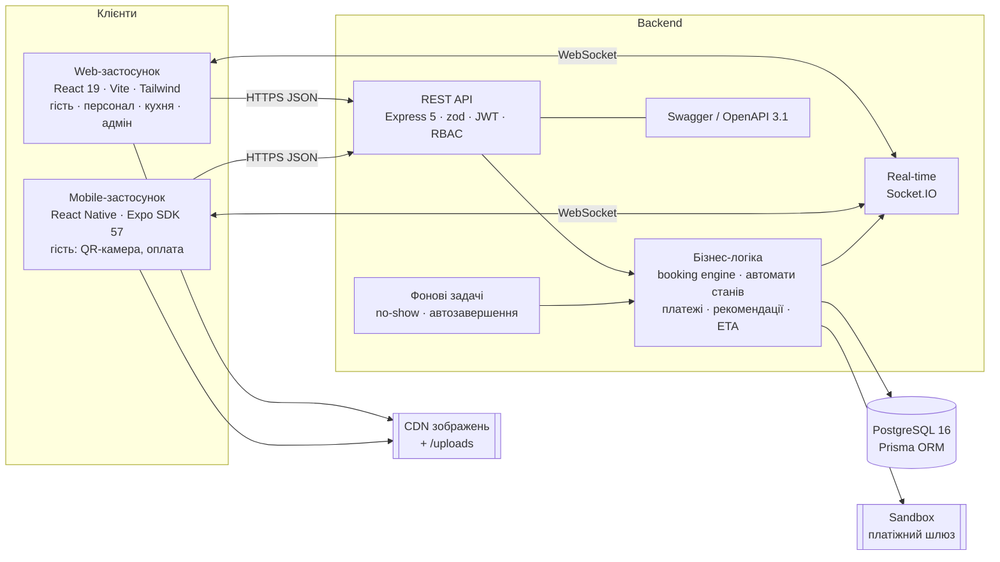
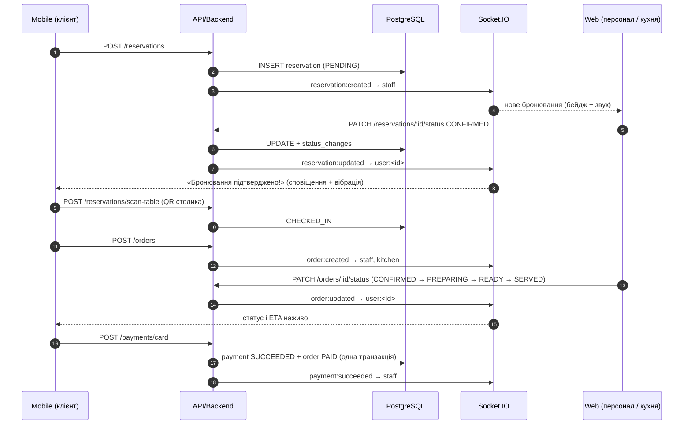

# 4. Архітектура системи

## 4.1 Загальна схема



**Принцип:** Web / Mobile → API → Backend → Database. Клієнти **ніколи** не звертаються до БД напряму. Обидва клієнти працюють з одним backend і однією базою, тому будь-яка зміна в одному клієнті одразу видна в іншому.

## 4.2 Компоненти

| Компонент | Технології | Роль |
|---|---|---|
| **Web** | React 19, TypeScript, Vite 7, Tailwind CSS 4, React Router 7, TanStack Query, Motion, Recharts, Socket.IO client, jsQR | Сайт для гостей (меню, бронювання, кабінет, оплата) + робоче місце персоналу (дашборд, план залу, бронювання, kanban, QR-сканер), Kitchen display, адмін-панель |
| **Mobile** | React Native 0.86, Expo SDK 57, React Navigation 7, expo-camera, expo-secure-store, expo-notifications, expo-haptics | Гостьовий застосунок: бронювання з планом залу, QR check-in камерою, меню й кошик, статус замовлення наживо, оплата, відгуки |
| **Backend/API** | Node.js 22, Express 5, TypeScript, zod 4, jsonwebtoken, bcryptjs, Luxon, helmet, rate-limit, multer | REST API, валідація, автентифікація й авторизація, бізнес-логіка |
| **Real-time** | Socket.IO 4 | Push-події статусів у кімнати `user:<id>`, `staff`, `kitchen`, `public` |
| **БД** | PostgreSQL 16, Prisma 6 (міграції) | 11 таблиць, CHECK/FK/UNIQUE/EXCLUDE-обмеження, індекси |
| **Документація API** | OpenAPI 3.1 генерується з тих самих zod-схем, що валідують запити | Swagger UI `/api/docs` |
| **Інфраструктура** | Docker Compose (db + backend + nginx-web), GitHub Actions CI | Запуск однією командою, автоматичні тести |

## 4.3 Структура backend

```
backend/src
├── app.ts / server.ts          # Express + HTTP + Socket.IO + планувальник
├── config.ts                   # env + правила ресторану (години, буфери, дедлайни)
├── lib/
│   ├── router.ts               # декларативні маршрути: валідація + RBAC + реєстр для OpenAPI
│   ├── stateMachine.ts         # автомати станів бронювання та замовлення
│   ├── realtime.ts             # Socket.IO, кімнати, emit
│   ├── openapi.ts, errors.ts, jwt.ts, time.ts, prisma.ts
├── middleware/ auth.ts, error.ts
├── modules/
│   ├── booking/engine.ts       # чисті функції booking engine (юніт-тести)
│   ├── booking/booking.service.ts
│   ├── reservations/           # бронювання, check-in, walk-in, QR
│   ├── orders/                 # замовлення, KDS, ETA, відгуки
│   ├── payments/sandbox.ts     # емуляція платіжного шлюзу
│   ├── recommendations/engine.ts
│   ├── menu/ tables/ users/ auth/ analytics/ uploads/
└── jobs/scheduler.ts           # no-show, автоскасування, автозавершення
```

## 4.4 Двостороння Web ↔ Mobile інтеграція



## 4.5 Безпека

* **Паролі** — bcrypt (10 раундів); **access JWT** (30 хв, issuer), **refresh-токени** — випадкові 48 байт, у БД лише SHA-256, одноразові з ротацією та виявленням повторного використання (відкликання всіх сесій).
* **Деактивація** користувача діє миттєво — стан перевіряється в БД на кожному запиті.
* **RBAC** на кожному endpoint + права в автоматах станів (власник / роль / система).
* **Серверна валідація** всіх тіл, query та path-параметрів (zod) з людськими повідомленнями.
* **Цілісність** — транзакції, advisory lock для бронювань, `SELECT … FOR UPDATE` для замовлень, EXCLUDE та partial unique індекси.
* **Платежі** — повний номер картки не зберігається; ідемпотентність; 3-D Secure.
* **QR** — непередбачувані токени (base64url 16–18 байт), перевипуск QR столика адміністратором.
* helmet, CORS, rate-limit на auth, обмеження розміру тіла та завантажень (тип + 5 МБ).
