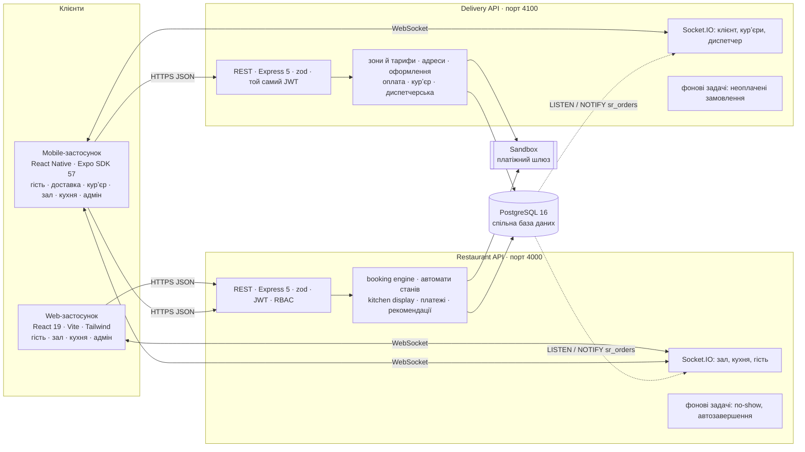
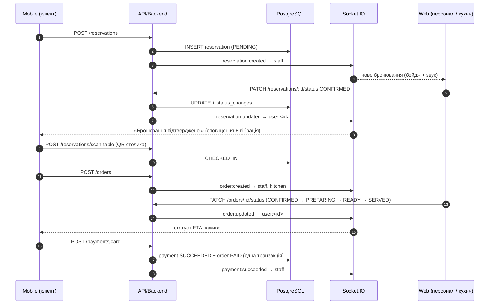
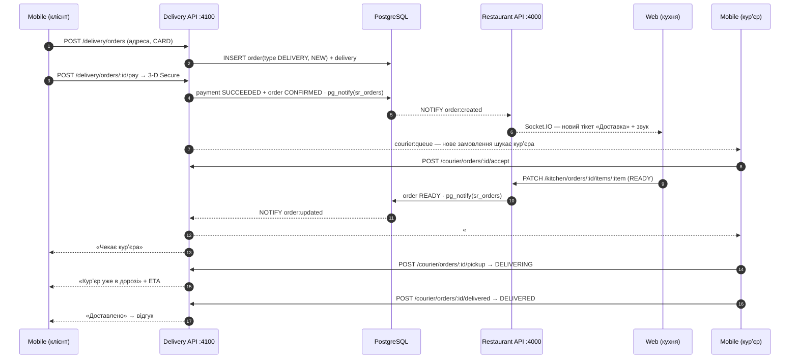

# 4. Архітектура системи

## 4.1 Загальна схема



**Дві системи — одна база даних.** Restaurant API обслуговує ресторан (Web і роботу в залі), Delivery API — службу доставки (мобільний застосунок клієнта й курʼєра). Це **два окремі процеси й два Docker-контейнери** з власними портами, Socket.IO-серверами, Swagger-специфікаціями та фоновими задачами. Спільні в них:

* **база даних PostgreSQL** — меню, користувачі, замовлення, платежі лежать в одних таблицях, тому доставка одразу потрапляє на kitchen display, а аналітика рахує і зал, і доставку;
* **обліковий запис** — вхід через `POST :4000/api/auth/login`, JWT приймають обидва сервіси (той самий секрет і issuer);
* **доменне ядро** (`backend/src/lib`, `modules/orders`, `modules/payments`) — автомати станів, ціни з БД, ETA, sandbox-платежі пишуться один раз і не розходяться між системами.

**Звʼязок між системами — через базу даних.** Кожна система надсилає події лише своїм клієнтам. Коли змінюється замовлення доставки, система виконує `pg_notify('sr_orders', {source, event, orderId})`; інша система слухає канал (`LISTEN`, бібліотека `pg`) і сповіщає своїх: Delivery API → кухня та зал у Web, Restaurant API (кухня позначила «Готово») → клієнт і курʼєри в мобільному. NOTIFY у транзакції доставляється лише після COMMIT, тож подія ніколи не випереджає дані.

**Принцип:** Web / Mobile → API → Database. Клієнти **ніколи** не звертаються до БД напряму.

## 4.2 Компоненти

| Компонент | Технології | Роль |
|---|---|---|
| **Web** | React 19, TypeScript, Vite 7, Tailwind CSS 4, React Router 7, TanStack Query, Motion, Recharts, Socket.IO client, jsQR | Сайт для гостей (меню, бронювання, кабінет, оплата) + робоче місце персоналу (дашборд, план залу, бронювання, kanban, QR-сканер), Kitchen display, адмін-панель |
| **Mobile** | React Native 0.86, Expo SDK 57, React Navigation 7, expo-camera, expo-secure-store, expo-notifications, expo-haptics | Гість: бронювання з планом залу, QR check-in камерою, меню й кошик, **доставка додому** (адреси, оформлення, оплата, відстеження курʼєра), статус наживо, відгуки. **Курʼєр**: черга, мої доставки, маршрут, готівка. Зал / адмін: **диспетчерська доставок**, зони й тарифи |
| **Restaurant API** | Node.js 22, Express 5, TypeScript, zod 4, jsonwebtoken, bcryptjs, Luxon, helmet, rate-limit, multer | REST API ресторану, валідація, автентифікація й авторизація, бізнес-логіка залу й кухні (порт 4000) |
| **Delivery API** | той самий стек, окремий процес `dist/delivery/server.js` | доставка: зони, адреси, розрахунок, оформлення, оплата, курʼєр, диспетчерська (порт 4100) |
| **Real-time** | Socket.IO 4 (у кожному сервісі свій) + PostgreSQL LISTEN/NOTIFY | Restaurant: `user:<id>`, `staff`, `kitchen`, `public`; Delivery: `user:<id>`, `couriers`, `dispatch` |
| **БД** | PostgreSQL 16, Prisma 6 (міграції) | 14 таблиць, CHECK/FK/UNIQUE/EXCLUDE-обмеження, тригер, індекси |
| **Документація API** | OpenAPI 3.1 генерується з тих самих zod-схем, що валідують запити | Swagger UI `/api/docs` |
| **Інфраструктура** | Docker Compose (db + backend + delivery + nginx-web), GitHub Actions CI | Запуск однією командою, автоматичні тести |

## 4.3 Структура backend

```
backend/src
├── app.ts / server.ts          # Express + HTTP + Socket.IO + планувальник
├── config.ts                   # env + правила ресторану (години, буфери, дедлайни)
├── lib/
│   ├── router.ts               # декларативні маршрути: валідація + RBAC + реєстр для OpenAPI
│   ├── stateMachine.ts         # автомати станів бронювання та замовлення
│   ├── realtime.ts             # Socket.IO, кімнати, emit
│   ├── openapi.ts, errors.ts, jwt.ts, time.ts, prisma.ts
├── middleware/ auth.ts, error.ts
├── modules/
│   ├── booking/engine.ts       # чисті функції booking engine (юніт-тести)
│   ├── booking/booking.service.ts
│   ├── reservations/           # бронювання, check-in, walk-in, QR
│   ├── orders/                 # замовлення, KDS, ETA, відгуки
│   ├── payments/sandbox.ts     # емуляція платіжного шлюзу
│   ├── recommendations/engine.ts
│   ├── menu/ tables/ users/ auth/ analytics/ uploads/
├── jobs/scheduler.ts           # no-show, автоскасування, автозавершення
├── lib/bus.ts                  # PostgreSQL LISTEN/NOTIFY між системами
└── delivery/                   # ── Delivery API (окремий процес, порт 4100) ──
    ├── server.ts, app.ts       # власний HTTP + Socket.IO + Swagger
    ├── routes.ts               # зони, адреси, quote, доставки, оплата, курʼєр, диспетчерська
    ├── delivery.service.ts     # тарифи, години, оформлення, курʼєрські дії
    ├── realtime.ts             # кімнати user / couriers / dispatch
    └── scheduler.ts            # скасування неоплачених онлайн-замовлень
```

## 4.4 Двостороння Web ↔ Mobile інтеграція (замовлення в залі)



## 4.5 Доставка: Mobile → Delivery API → кухня у Web → курʼєр



## 4.6 Безпека

* **Паролі** — bcrypt (10 раундів); **access JWT** (30 хв, issuer), **refresh-токени** — випадкові 48 байт, у БД лише SHA-256, одноразові з ротацією та виявленням повторного використання (відкликання всіх сесій).
* **Деактивація** користувача діє миттєво — стан перевіряється в БД на кожному запиті.
* **RBAC** на кожному endpoint + права в автоматах станів (власник / роль / система).
* **Серверна валідація** всіх тіл, query та path-параметрів (zod) з людськими повідомленнями.
* **Цілісність** — транзакції, advisory lock для бронювань, `SELECT … FOR UPDATE` для замовлень, EXCLUDE та partial unique індекси.
* **HTTPS** — у Docker nginx обслуговує сайт лише по TLS 1.2/1.3 (`https://localhost:8443`), HTTP перенаправляє на HTTPS; API і WebSocket (`wss://`) проксуються через той самий захищений канал. Сертифікат — довірений від mkcert (`scripts/setup-https.sh`) або самопідписаний, створений контейнером. Заголовки: `X-Content-Type-Options`, `X-Frame-Options: DENY`, `Referrer-Policy`, `Permissions-Policy`.
* **Платежі** — форма працює лише через HTTPS у Docker-версії; CVC вводиться приховано і ніде не зберігається; повний номер картки не зберігається (лише бренд і останні 4 цифри); ідемпотентність; 3-D Secure.
* **QR** — непередбачувані токени (base64url 16–18 байт), перевипуск QR столика адміністратором.
* helmet, CORS, rate-limit на auth, обмеження розміру тіла та завантажень (тип + 5 МБ).
