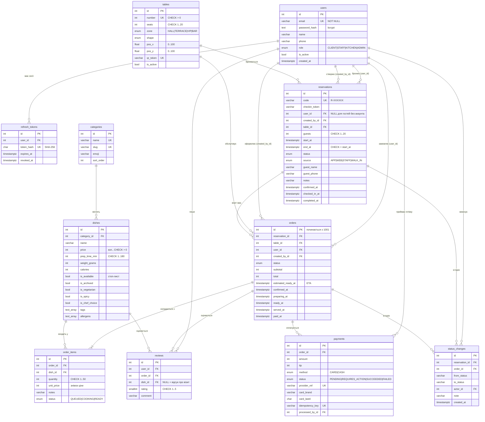

# 5. Логічна модель бази даних

СУБД — **PostgreSQL 16**, схема описана в `backend/prisma/schema.prisma`, створюється міграціями (`backend/prisma/migrations`). Гроші зберігаються цілими числами в копійках.

## 5.1 ER-діаграма (логічна модель)

## 5.2 Призначення таблиць

| Таблиця | Призначення |
|---|---|
| `users` | Облікові записи всіх ролей. Роль визначає доступ (RBAC). |
| `refresh_tokens` | Сесії: хеші refresh-токенів для ротації та відкликання. |
| `categories`, `dishes` | Меню. `is_available` — стоп-лист, `is_archived` — м'яке видалення страв, що вже є в історії. |
| `tables` | Столики з координатами на плані залу та унікальним QR-токеном. |
| `reservations` | Бронювання / візити (у т.ч. walk-in) — центральна сутність бізнес-процесу. |
| `orders`, `order_items` | Замовлення за столиком у межах візиту; ціна фіксується на момент замовлення. |
| `payments` | Спроби оплат (карткою через sandbox або готівкою). |
| `reviews` | Відгуки про візит (dish_id = NULL) та оцінки страв. |
| `status_changes` | Аудит бізнес-процесу: хто, коли і з якого в який стан перевів бронювання / замовлення. |

## 5.3 Обмеження цілісності

| Обмеження | Тип | Навіщо |
|---|---|---|
| `reservations_no_overlap` | **EXCLUDE USING gist** (`table_id =`, `tstzrange(start_at,end_at) &&`) `WHERE status IN (PENDING, CONFIRMED, CHECKED_IN)` | Гарантія на рівні БД: столик не може мати два активні бронювання з перетином часу — навіть при паралельних запитах чи записі в обхід API |
| `payments_one_success_per_order` | partial UNIQUE (`order_id`) `WHERE status = 'SUCCEEDED'` | Неможлива подвійна успішна оплата |
| `reviews_one_visit_review_per_order` | partial UNIQUE (`order_id`) `WHERE dish_id IS NULL` + UNIQUE (`order_id`, `dish_id`) | Один відгук про візит і одна оцінка кожної страви |
| `status_changes_single_target` | CHECK `num_nonnulls(reservation_id, order_id) = 1` | Запис історії належить рівно одному обʼєкту |
| `reservations_guest_identity` | CHECK `user_id IS NOT NULL OR guest_name IS NOT NULL` | Бронювання завжди має гостя |
| `reservations_time_order` | CHECK `end_at > start_at` | Коректний інтервал |
| Діапазони | CHECK: ціна > 0, кількість 1..50, місць 1..20, рейтинг 1..5, час приготування 1..180, координати 0..100, `card_last4 ~ '^[0-9]{4}$'` | Валідність даних незалежно від клієнта |
| FK | `ON DELETE RESTRICT` для бізнес-даних (страва в замовленні, столик у бронюванні), `CASCADE` для залежних (позиції, історія), `SET NULL` для авторів | Referential integrity |

## 5.4 Індекси

| Індекс | Для чого |
|---|---|
| `reservations (table_id, start_at)` | пошук зайнятості столика — booking engine |
| `reservations (status, start_at)`, `(user_id, start_at)` | списки бронювань персоналу та клієнта, фонові задачі |
| `orders (status, created_at)`, `(user_id, created_at)`, `(reservation_id)` | kanban, KDS, історія клієнта, рахунок візиту |
| `order_items (order_id)`, `(dish_id)` | склад замовлення, аналітика продажів і рекомендації |
| `payments (order_id)`, `(status, paid_at)` | оплати замовлення, виручка за період |
| `dishes (category_id)`, `(is_available, is_archived)` | меню |
| GiST (`reservations_no_overlap`) | перевірка перетину інтервалів |

## 5.5 Нормалізація

Схема відповідає **3НФ**: кожен неключовий атрибут залежить лише від ключа своєї таблиці. Свідома денормалізація:
* `order_items.unit_price` — **знімок** ціни на момент замовлення (історична правильність рахунку при зміні меню);
* `orders.table_id` — копія столика візиту для швидких запитів KDS / плану залу (оновлюється при пересадці гостей разом із бронюванням).
