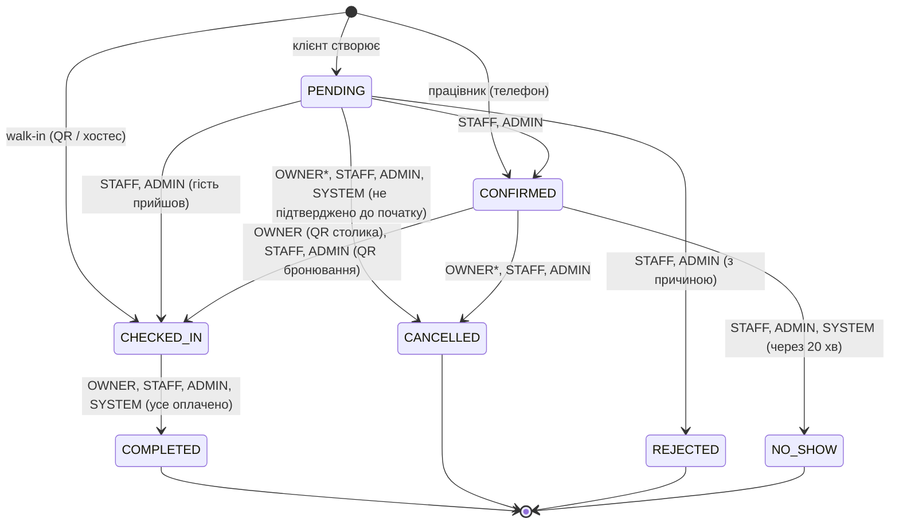
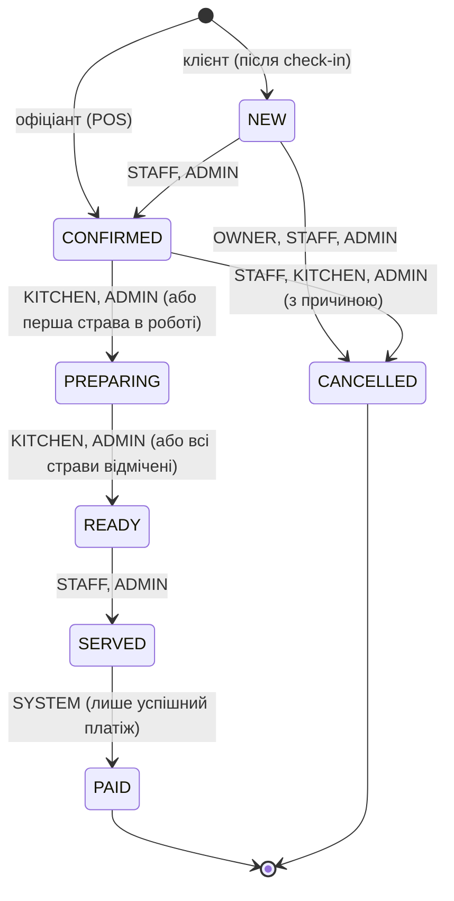
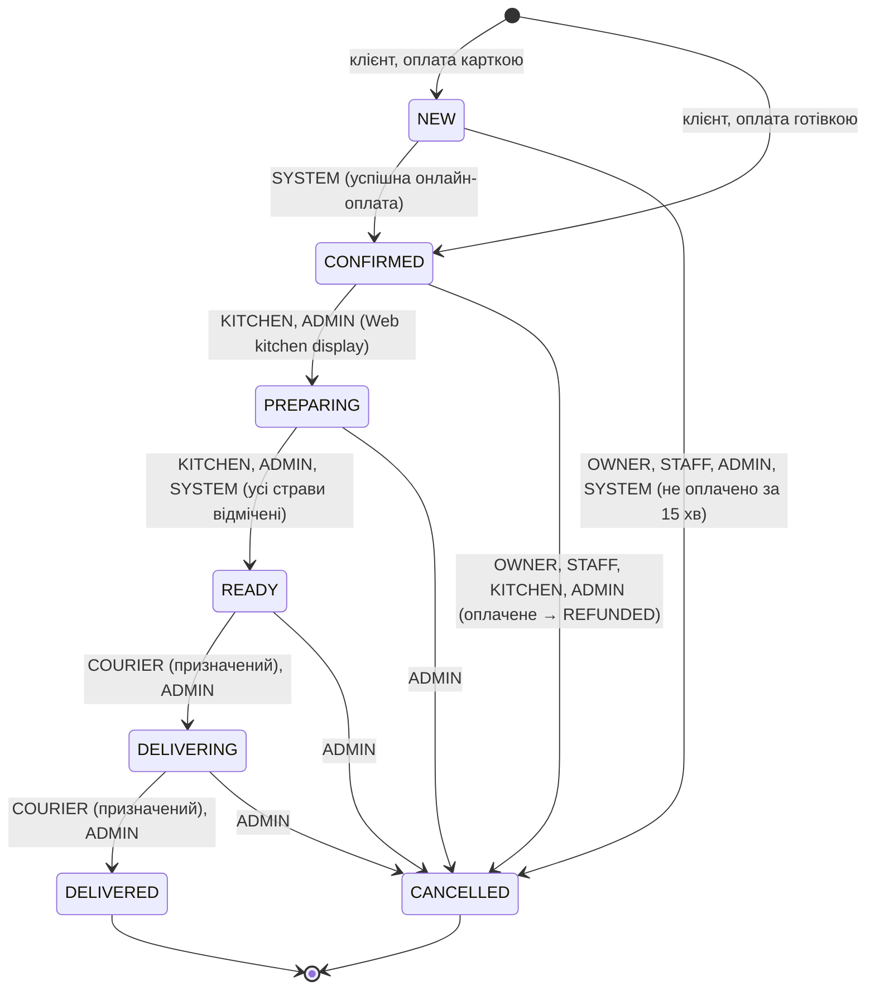

# 7. Бізнес-логіка: стани та правила

Ключові процеси реалізовано як **скінченні автомати** (`backend/src/lib/stateMachine.ts`): бронювання, замовлення в залі (`ORDER_FLOW`) і доставка (`DELIVERY_FLOW`). Для кожного переходу задано, *хто* може його виконати: власник ресурсу (`OWNER`), роль (`STAFF`, `KITCHEN`, `ADMIN`, `COURIER`) або лише сервер (`SYSTEM`). Недопустимий перехід → **409 INVALID_TRANSITION**, перехід не для цієї ролі → **403 TRANSITION_FORBIDDEN**. Кожна зміна записується в `status_changes` і розсилається в реальному часі.

## 7.1 Бронювання (візит)

`*` — клієнт може скасувати онлайн не пізніше ніж за 60 хв до початку.

| Правило | Де перевіряється | Код помилки |
|---|---|---|
| Час кратний 30 хв (клієнт) / 15 хв (персонал), у межах годин роботи, візит закінчується до закриття | `validateReservationWindow` | 422 `INVALID_SLOT`, `OUTSIDE_OPENING_HOURS` |
| Клієнт бронює щонайменше за 30 хв і не більше ніж на 60 днів уперед | те саме | 422 `TOO_LATE_TO_BOOK`, `DATE_TOO_FAR` |
| 1–12 гостей; тривалість залежить від кількості (90/120/150/180 хв) | `assertGuests`, `durationForParty` | 400 `INVALID_GUESTS` |
| Столик вільний з урахуванням 15-хв буфера на прибирання | booking engine + advisory lock + EXCLUDE | 409 `TABLE_ALREADY_BOOKED` / `NO_TABLES_AVAILABLE` (+ альтернативи) |
| Не більше 3 активних майбутніх бронювань на клієнта, без власних перетинів | `createReservation` | 409 `TOO_MANY_RESERVATIONS`, `OVERLAPPING_OWN_RESERVATION` |
| Check-in: не раніше ніж за 60 хв і до кінця візиту; клієнт — лише скануванням QR **свого** столика; столик має бути вільним | `transitionReservation` | 409 `CHECKIN_TOO_EARLY`, `WRONG_TABLE`, `TABLE_NOT_READY` / 403 |
| Ранній check-in зсуває початок візиту (чесна зайнятість столика) | те саме | — |
| Завершити візит можна лише без неоплачених замовлень | те саме | 409 `UNPAID_ORDERS` |
| Скасований / відхилений / no-show / завершений візит миттєво звільняє столик | EXCLUDE діє лише для активних статусів | — |
| Walk-in: столик вільний зараз; візит обмежується наступним бронюванням (мін. 45 хв) | `walkInWindow` | 409 `TABLE_UNAVAILABLE` |

**Фонові задачі** (щохвилини, `jobs/scheduler.ts`): `PENDING` після початку → `CANCELLED`; `CONFIRMED` через 20 хв після початку → `NO_SHOW`; `CHECKED_IN` через годину після кінця без боргів → `COMPLETED`.

## 7.2 Замовлення в залі

| Правило | Код помилки |
|---|---|
| Замовлення за столиком — лише в межах візиту `CHECKED_IN` (доставка — окремий процес, див. 7.3) | 409 `NOT_CHECKED_IN` / `TABLE_NOT_OCCUPIED` |
| Страви зі стоп-листа / архіву не приймаються | 409 `DISH_UNAVAILABLE` |
| Ціни беруться лише з БД; однакові позиції обʼєднуються; до 50 порцій | 422 `QUANTITY_TOO_LARGE` |
| Клієнт скасовує лише `NEW`; персонал — до початку приготування і з причиною | 403 / 422 `REASON_REQUIRED` |
| Офіціант не може «готувати», кухар не може «подати» | 403 `TRANSITION_FORBIDDEN` |
| Статус `PAID` не можна встановити вручну | 403 |
| Оплата лише після подачі (`SERVED`); скасоване / оплачене не оплачується | 409 `ORDER_NOT_SERVED`, `ORDER_CANCELLED`, `ALREADY_PAID` |
| Відгук — лише власником, лише після оплати (або доставки), лише один раз; оцінювати можна тільки страви з замовлення | 409 `ORDER_NOT_PAID`, `ALREADY_REVIEWED`, 422 `DISH_NOT_IN_ORDER` |

## 7.3 Доставка (Delivery API)

Курʼєр **приймає** замовлення, поки воно готується (`CONFIRMED`/`PREPARING`/`READY`, призначення не змінює статус), і **забирає** його лише коли кухня позначила «Готово». Диспетчер (зал / адміністратор) може призначити чи зняти курʼєра.

| Правило | Код помилки |
|---|---|
| Доставку оформлює лише клієнт; години доставки — від відкриття кухні до закриття мінус 45 хв (після півночі діє вікно попереднього дня) | 403 / 409 `DELIVERY_CLOSED` (з часом відкриття) |
| Район має бути активним; сума страв ≥ мінімальної для району; тариф 0 ₴ від порогу безкоштовної доставки | 409 `ZONE_INACTIVE`, 422 `BELOW_MIN_ORDER` (+ скільки бракує) |
| Телефон приводиться до `+380XXXXXXXXX`; «решта з» — не менша за суму і лише для готівки | 422 `PHONE_INVALID`, `CHANGE_TOO_SMALL` |
| Не більше 3 активних доставок на клієнта (рядок клієнта блокується `FOR UPDATE` від «подвійного тапу») | 409 `TOO_MANY_ACTIVE_DELIVERIES` |
| Ціни лише з БД, стоп-лист діє так само, як у залі (спільна функція `resolveLines`) | 409 `DISH_UNAVAILABLE` |
| Онлайн-оплата лише власником і лише для `NEW` з методом `CARD`; після успіху — `CONFIRMED` і тікет на кухні | 403 / 409 `ORDER_NOT_AWAITING_PAYMENT`, `PAYMENT_METHOD_CASH`, `ALREADY_PAID` |
| Курʼєр — не більше 2 активних замовлень; взяти можна лише вільне; забрати — лише своє і лише `READY` | 409 `COURIER_BUSY`, `ALREADY_TAKEN`, `NOT_READY`, 403 |
| Готівка: платіж `CASH` фіксує курʼєр під час вручення (`processed_by_id`) | — |
| Клієнт скасовує лише до початку приготування; оплачене повертається (`REFUNDED`) | 409 `TOO_LATE_TO_CANCEL` |
| Статуси курʼєра недоступні через Restaurant API | 409 `USE_DELIVERY_API` |
| Прогноз доставки = черга кухні (як для залу) + приготування + 5 хв передачі + час у дорозі району; після «забрав» — лише дорога | — |

**Фонові задачі Delivery API** (щохвилини, `delivery/scheduler.ts`): онлайн-замовлення, не оплачене за 15 хв, → `CANCELLED`.

## 7.4 Паралельність і узгодженість

* **Бронювання** створюються/змінюються в транзакції з `pg_advisory_xact_lock` — перевірка вільності й вставка атомарні. Остання лінія захисту — EXCLUDE-обмеження (помилка `23P01` перетворюється на 409).
* **Замовлення** змінюються з `SELECT … FOR UPDATE` на рядку замовлення — дві дії кухні/офіціанта не перетирають одна одну.
* **Оплата**: авторизація в шлюзі поза транзакцією (не тримаємо блокування під час мережевої затримки), фіналізація — в транзакції з блокуванням та повторною перевіркою статусу; partial unique index гарантує одну успішну оплату.
* **Курʼєри**: прийняти / забрати / вручити — у транзакції з `SELECT … FOR UPDATE` на замовленні, тож двоє курʼєрів не візьмуть одне замовлення.
* **Дві системи** змінюють спільні замовлення через ту саму функцію `transitionOrder` (одна реалізація автомата), а сповіщають одна одну через `pg_notify` усередині транзакції — подія доставляється лише після COMMIT.
